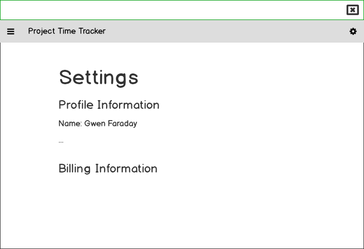

# Hour Tracking App

This app is to help you track your hours and generate invoices for clients as a freelancer or consultant.

**Table of Contents**

1. [Requirements](#requirements)
1. [Tech Stack](#tech-stack)
1. [Schema](#schema)
1. [Mockups](#mockups)
1. [Design](#design)
1. [Roadmap](#roadmap)

## Requirements

* Users can keep track of the hours they work
* Users can select which project (client) they are working on
* Users can see a log of entries when they start the timer and stop the timer (manual entry for MVP)
* Users can set their hourly rate and business info in settings
* Users can generate an invoice for each client
* Users can see an overview of how much time they spent on each project over the last week/month/year

## Tech Stack

* Vue.js
* NW.js (desktop application framework for Node.js)
* Database (haven't chosen one yet)
* Bootstrap

## Schema

### User

*This app assumes there is only one user for each install. user information is used for generating client invoices.*

* firstName
* lastName
* streetAddress
* streetAddress2
* city
* state
* zip
* country
* phone
* email
* billingDetails? -> this needs to be more thought out

### TimeEntry

* start: timestamp
* stop: timestamp
* notes: textfield
* project: FK

### Project

* name: charfield
* description: textfield
* color: charfield
* createdAt: timestamp
* updatedAt: timestamp

### Log

* text: textfield
* createdAt: timestamp
* updatedAt: timestamp
* project: FK

## Mockups

## Design

### Colors

$dark-blue: #0D3B66

$off-white: #FAF0CA

$yellow: #F4D35E

$orange: #EE964B

$peach: #F95738

## Roadmap

### MVP

* Hours log table
* Add new hours entries
* Create new projects (to associate hours with)
* Settings

### Version 1

* Task tracking under projects
* Exports
* Billing Settings
* Notifications
